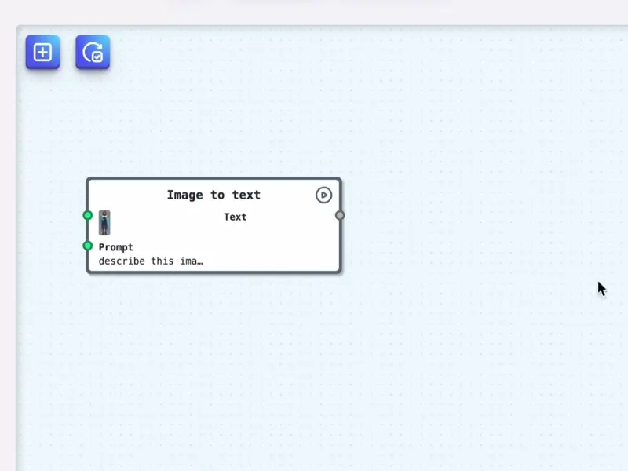
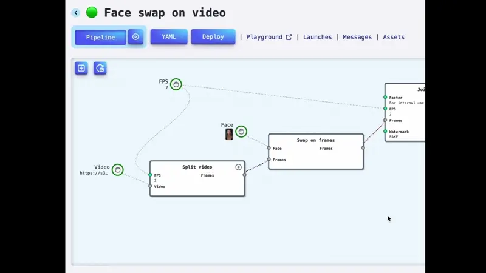

# Piper – Visual AI Pipeline Builder & Beyond ✨

We're currently in Beta 🧪

**Design AI Workflows Visually, Deploy Instantly ⚡**

Build and automate AI pipelines with an intuitive visual editor.
Connect models, process data, and deploy powerful AI workflows in minutes.
Turn your ideas 💡 into production-ready AI products effortlessly.

## Use AI models at canvas

Drag and drop AI models onto a visual canvas to design powerful workflows. Connect nodes, customize settings, and see your pipeline come to life — without writing a single line of code.



- Drag-and-Drop Interface
- Multi-Model Integration
- Real-Time Visualization
- Customizable Nodes

## Run & test in playground

Easily set inputs and run AI pipelines with a single click in a fully customizable UI. See real-time results, adjust settings, and fine-tune for the perfect output.


- Interactive Controls
- Customizable UI
- Outputs Gallery
- Batch Execution

## Deploy pipelines as API

Turn your AI workflows into fully functional APIs with just a few clicks. Seamlessly integrate, scale, and access your pipelines anywhere, anytime.



- One-Click API Deployment
- Auto-Generated API Endpoints
- Scalable Infrastructure 🔥🔥🔥
- Rate limits, etc.

# Resources

- 📚 [Academy](https://huggingface.co/spaces/PiperMy/Academy)
- 👥 [Community Forum](https://github.com/my-piper/piper/discussions)

# Self-hosted deploy

Detailed specifications are coming ⏳ soon...

Meanwhile, you can explore the Docker Swarm [configuration](https://github.com/my-piper/piper-swarm) to get started!

Here's your improved version:

# Why Piper?

- **Open and Flexible YAML Specification**  
  Define and manage pipelines transparently with an open YAML-based specification.

- **Runtime JavaScript Customization**  
  Dynamically create and modify custom nodes using JavaScript at runtime for unmatched flexibility.

- **Easy Import and Export of Pipelines**  
  Seamlessly import and export pipelines for convenient reuse and collaboration.

- **Reusable Node Packages**  
  Share and distribute custom nodes effortlessly with built-in package management.

# Development

## 🛠️ Prerequisites

- Docker Desktop 🐳
- Node.js 22
- VS code or alternative IDE

## To do

Clone repo with ❗️ sub-modules

```bash
git clone --recurse-submodules git@github.com:my-piper/piper.git
```

Run services

```bash
make up
```

Compile schemas

```bash
make schemas
```

Prepare environment

```bash
cp backend/.env.template backend/.env
```

Create Mongo indexes

```bash
npm run cli mongo create
```

Add admin user

```bash
npm --prefix backend run cli users add admin admin@piper.my xyzXYZ admin
```

Run socket server

```bash
cd backend
npm run sockets
npm run server
./worker.sh -i
```

Run backend

```bash
npm run server
```

Run workers

```bash
./worker.sh
```

Run frontend

```bash
cd frontend
npm start
```

Open `http://localhost/`

Read first tutorial how run create & run first pipeline!

# CLI

## Get environment

```bash
npm --prefix backend run cli env
```

## Set variable

```bash
npm --prefix backend run cli env set -- --name XXX --value xyzXYZ
```

## Remove variable

```bash
npm --prefix backend run cli env remove -- --name XXX
```

# Modules

## List

```bash
npm run cli modules
```

## Install module

```bash
npm run cli modules add openai 4.85.4
```

## Remove module

```bash
npm run cli modules remove openai
```

## Update

```bash
npm run cli modules update
```

## Reboot workers

```bash
npm run cli workers reboot
```

# How to

## Remove launches with errors

```js
db.launches.deleteMany({ errors: { $exists: true, $not: { $size: 0 } } });
```
